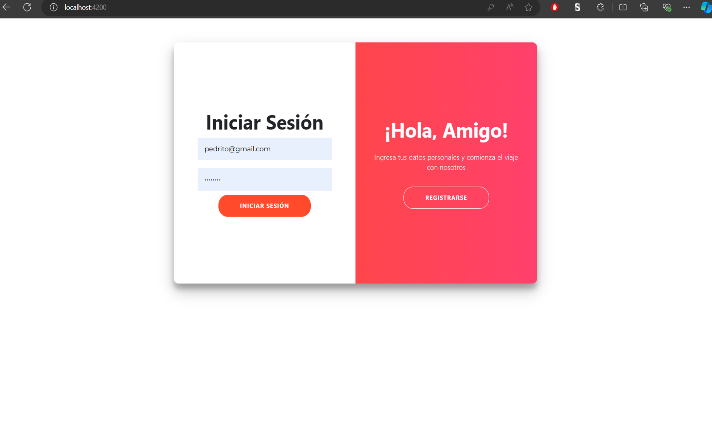
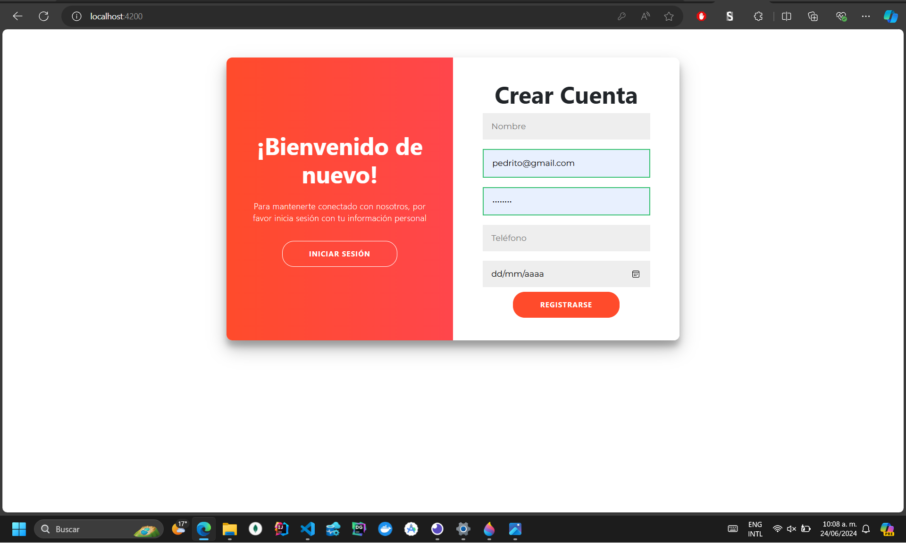
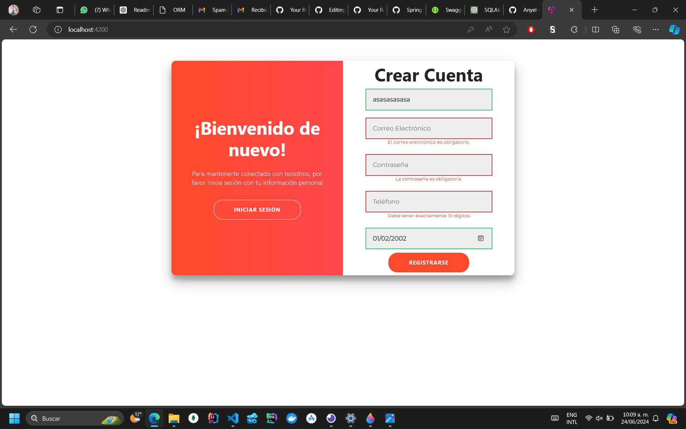
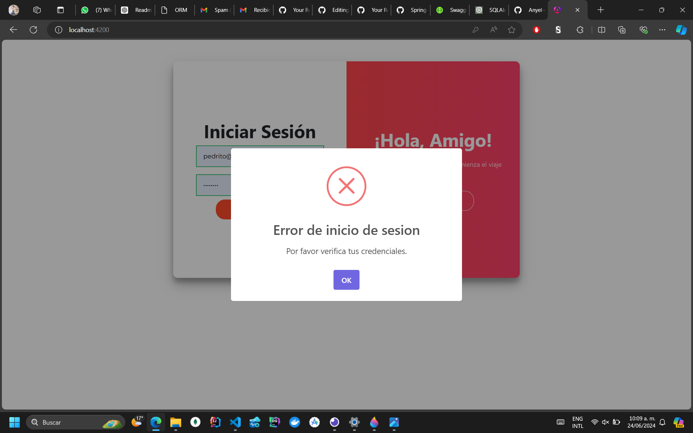

# **Select Language:** 🌍
- [Español (Spanish)](README-es.md)
- [English](README.md)

# Proyecto de Front-End de Redes Sociales

Este proyecto es una implementación de front-end de una plataforma de redes sociales que interactúa con microservicios construidos con Flask y Spring Boot. La aplicación permite a los usuarios registrarse, iniciar sesión, crear publicaciones y comentar en publicaciones. El front-end está desarrollado usando Angular.

## RESULTS
### Login 

### Register 

### Validation 

### Login 


## Tabla de Contenidos

- [Características](#características)
- [Tecnologías Usadas](#tecnologías-usadas)
- [Configuración e Instalación](#configuración-e-instalación)
- [Estructura del Proyecto](#estructura-del-proyecto)
- [Servicios](#servicios)
- [Componentes](#componentes)
- [Contribuyendo](#contribuyendo)
- [Licencia](#licencia)

## Características

- Autenticación de Usuarios: Registro, inicio de sesión y gestión de sesiones.
- Gestión de Publicaciones: Crear, leer, actualizar y eliminar publicaciones.
- Gestión de Comentarios: Agregar, editar, eliminar y responder a comentarios.
- Categorías: Obtener y mostrar categorías para publicaciones.
- Perfiles de Usuario: Obtener detalles de usuarios y gestionar perfiles de usuarios.

## Tecnologías Usadas

- **Front-End:** Angular, TypeScript, HTML, CSS
- **Microservicios Back-End:** Flask, Spring Boot
- **Cliente HTTP:** Angular HttpClient
- **Componentes UI:** PrimeNG, Bootstrap
- **Notificaciones:** SweetAlert2

## Configuración e Instalación

### Prerrequisitos

- Node.js y npm instalados
- Angular CLI instalado
- Microservicios back-end en funcionamiento (Flask en el puerto 5000, Spring Boot en el puerto 8080)

### Instalación

1. Clona el repositorio:

    ```bash
    git clone https://github.com/Anyel-ec/Angular-18-RestApi-SocialMedia
    cd Angular-18-RestApi-SocialMedia
    ```

2. Instala las dependencias:

    ```bash
    npm install
    ```

3. Ejecuta la aplicación Angular:

    ```bash
    ng serve
    ```

4. Accede a la aplicación en `http://localhost:4200`.

## Estructura del Proyecto

```
src/
├── app/
│   ├── components/
│   │   ├── login/
│   │   │   ├── login.component.html
│   │   │   ├── login.component.scss
│   │   │   ├── login.component.ts
│   │   ├── home/
│   │   │   ├── home.component.html
│   │   │   ├── home.component.scss
│   │   │   ├── home.component.ts
│   │   ├── nav/
│   │   │   ├── nav.component.html
│   │   │   ├── nav.component.scss
│   │   │   ├── nav.component.ts
│   ├── services/
│   │   ├── flask/
│   │   │   ├── categories.service.ts
│   │   │   ├── comments.service.ts
│   │   │   ├── posts.service.ts
│   │   │   ├── users.service.ts
│   │   ├── spring-boot/
│   │   │   ├── comment-spring.service.ts
│   │   ├── shared/
│   │   │   ├── session.service.ts
│   ├── app.component.html
│   ├── app.component.scss
│   ├── app.component.ts
│   ├── app.module.ts
├── assets/
├── environments/
│   ├── environment.prod.ts
│   ├── environment.ts
...

```

## Servicios

### CategoriesService

Maneja operaciones relacionadas con categorías.

```typescript
@Injectable({
  providedIn: 'root'
})
export class CategoriesService {
  private apiUrl = 'http://localhost:5000/api/categories';
  
  constructor(private http: HttpClient) { }

  getCategories(): Observable<any> {
    return this.http.get<any>(this.apiUrl);
  }
}
```

### CommentsService

Maneja operaciones relacionadas con comentarios en Flask.

```typescript
@Injectable({
  providedIn: 'root'
})
export class CommentsService {
  private apiUrl = 'http://127.0.0.1:5000/api/getComment';

  constructor(private http: HttpClient) { }

  getComments(): Observable<any> {
    return this.http.get<any>(this.apiUrl);
  }
}
```

### PostsService

Maneja operaciones relacionadas con publicaciones.

```typescript
@Injectable({
  providedIn: 'root'
})
export class PostsService {
  private apiUrl = 'http://localhost:5000/api/posts';

  constructor(private http: HttpClient) { }

  createPost(postData: any): Observable<any> {
    return this.http.post<any>(this.apiUrl, postData);
  }

  getPosts(): Observable<any> {
    return this.http.get<any>(this.apiUrl);
  }

  deletePost(postId: number): Observable<any> {
    const url = `${this.apiUrl}/${postId}`;
    return this.http.delete<any>(url);
  }
  
  updatePost(postId: number, postData: any): Observable<any> {
    const url = `${this.apiUrl}/${postId}`;
    return this.http.put<any>(url, postData);
  }
}
```

### UsersService

Maneja operaciones relacionadas con usuarios.

```typescript
@Injectable({
  providedIn: 'root'
})
export class UsersService {
  private apiUrl = 'http://localhost:5000/api/users';

  constructor(private http: HttpClient) { }

  getUsers(): Observable<any> {
    return this.http.get<any>(this.apiUrl);
  }

  login(email: string, password: string): Observable<any> {
    const loginUrl = `${this.apiUrl}/verify`;
    const body = { email, password };
    return this.http.post<any>(loginUrl, body);
  }

  register(user: any): Observable<any> {
    return this.http.post<any>(this.apiUrl, user);
  }

  getUserByEmail(email: string): Observable<any> {
    const url = 'http://localhost:5000/api/user/data';
    const params = { email };
    return this.http.get<any>(url, { params });
  }

  getUserById(userId: number): Observable<any> {
    const url = `${this.apiUrl}/${userId}`;
    return this.http.get<any>(url);
  }

  getVerifyExitsUser(email: string): Observable<any> {
    const url = 'http://localhost:5000/api/users/verify_exist';
    const body = { email };
    return this.http.post<any>(url, body);
  }
}
```

### CommentSpringService

Maneja operaciones relacionadas con comentarios en Spring Boot.

```typescript
@Injectable({
  providedIn: 'root'
})
export class CommentSpringService {
  private apiUrl = 'http://localhost:8080/comment';

  constructor(private http: HttpClient) {}

  addResponse(commentId: number, response: Comment): Observable<Comment> {
    return this.http.put<Comment>(`${this.apiUrl}/${commentId}/response`, response);
  }

  getCommentsByPostId(postId: number): Observable<any> {
    return this.http.get(`${this.apiUrl}/post/${postId}`);
  }

  addComment(comment: any): Observable<any> {
    return this.http.post(`${this.apiUrl}/save`, comment);
  }

  addReplyToComment(id: number, reply: any): Observable<any> {
    return this.http.post(`${this.apiUrl}/${id}/reply`, reply);
  }

  updateComment(id: number, comment: any): Observable<any> {
    return this.http.put(`${this.apiUrl}/${id}/update`, comment);
  }

  deleteComment(id: number): Observable<any> {
    return this.http.delete(`${this.apiUrl}/${id}/delete`);
  }
}
```

### SessionService

Maneja los datos de la sesión del usuario.

```typescript
@Injectable({
  providedIn: 'root'
})
export class SessionService {
  setUser(user: any): void {
    if (typeof window !== 'undefined') {
      sessionStorage.setItem('user', JSON.stringify(user));
    }
  }

  getUser(): any {
    if (typeof window !== 'undefined') {
      const user = sessionStorage.getItem('user');
      return user ? JSON.parse(user) : null;
    }
    return null;
  }

  clearUser(): void {
    if (typeof window !== 'undefined') {
      sessionStorage.removeItem('user');
    }
  }
}
```

## Componentes

### LoginComponent

Maneja el inicio de sesión y el registro de usuarios.

```typescript
@Component({
  selector: 'app-login',
  templateUrl: './login.component.html',
  styleUrls: ['./login.component.scss'],
  standalone: true,
  imports: [CommonModule, HttpClientModule, FormsModule, ReactiveFormsModule],
  providers: [UsersService, UserDjangoService]
})
export class LoginComponent {
  // ...
}
```

### NavComponent

Maneja la barra de navegación y el cierre de sesión de usuarios.

```typescript
@Component({
  selector: 'app-nav',
  standalone: true,
  imports: [],
  providers: [SessionService],
  templateUrl: './nav.component.html',
  styleUrls: ['./nav.component.scss']
})
export class NavComponent {
  // ...
}
```

### HomeComponent

Componente principal para mostrar publicaciones y comentarios.

```typescript
@Component

({
  selector: 'app-home',
  standalone: true,
  imports: [InputTextareaModule, NavComponent, FormsModule, HttpClientModule, CommonModule],
  providers: [PostsService, CategoriesService, UsersService, CommentSpringService],
  templateUrl: './home.component.html',
  styleUrls: ['./home.component.scss']
})
export class HomeComponent {
  // ...
}
```

## Contribuyendo

¡Las contribuciones son bienvenidas! Por favor, lee las [directrices de contribución](CONTRIBUTING.md) para más información.
